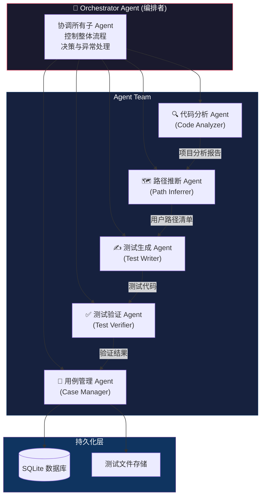
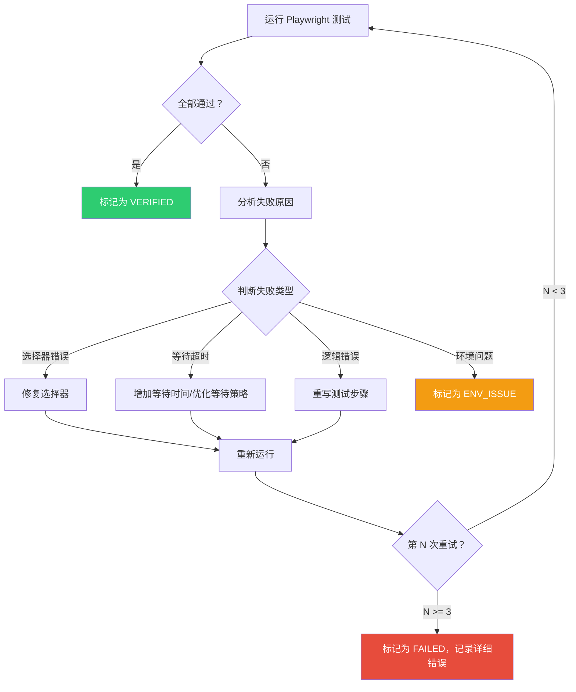
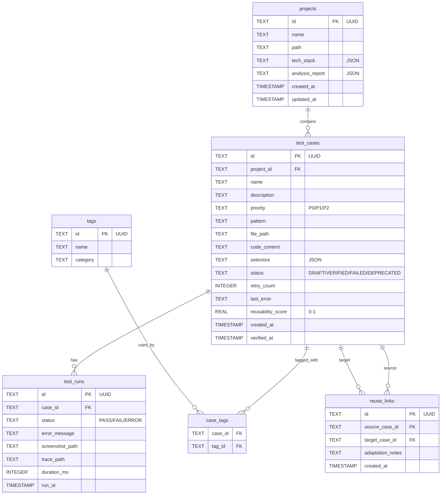
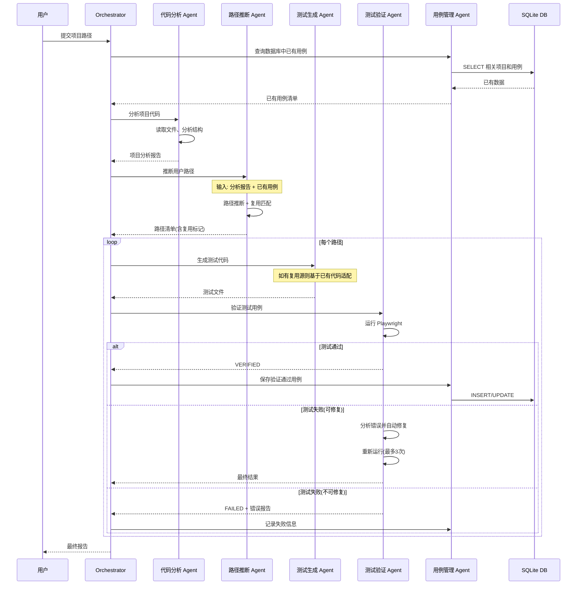
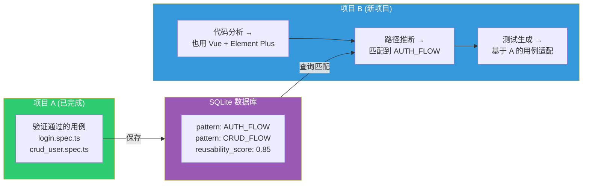
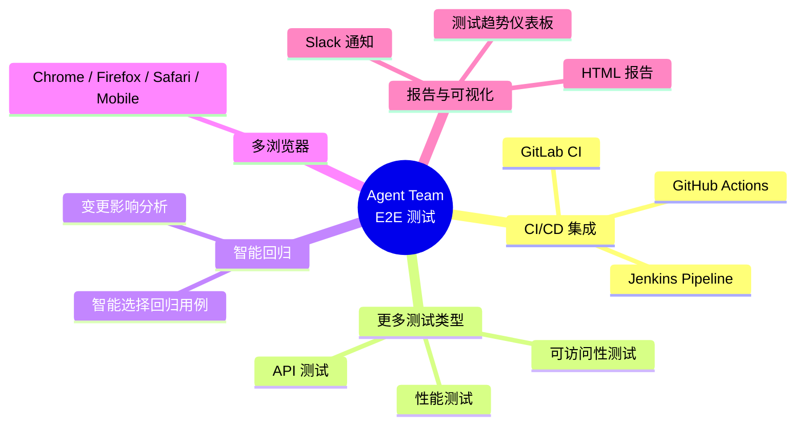

# Agent Team 端到端测试系统设计方案 V1

> **版本**: V1.0 — 完整多 Agent 协作方案  
> **定位**: 终态愿景，适合项目规模 10+ 且已有 V2 运行经验后的演进目标  
> **技术栈**: Claude Agent SDK + Playwright + SQLite + SQLAlchemy  
> **日期**: 2026-02-24

> [!WARNING]
> 此方案为完整终态设计。如果你是从零开始，建议先阅读 [V2 简化方案](./agent-team-e2e-design-v2.md) 并从 V2 起步，积累经验后按需向 V1 演进。

---

## 一、系统概述

### 1.1 目标

构建一个 **Agent Team**（多智能体协作团队），实现以下全自动化流程：

1. **读懂项目代码** → 分析项目结构、技术栈、路由、组件关系
2. **推断核心用户交互路径** → 识别关键业务流程和用户操作路径
3. **生成 E2E 测试代码** → 基于 Playwright 自动编写测试用例
4. **自动验证测试用例** → 运行测试并修复失败用例
5. **持久化管理** → 将验证通过的用例存入本地数据库，支持跨项目复用

### 1.2 技术栈

| 组件 | 技术选型 | 说明 |
|------|---------|------|
| Agent 编排 | [Claude Agent SDK (Python)](https://platform.claude.com/docs/zh-CN/agent-sdk/overview) | 多智能体编排与协作 |
| E2E 测试框架 | [Playwright](https://playwright.dev/) | 跨浏览器端到端测试 |
| 本地数据库 | SQLite + SQLAlchemy | 轻量级本地持久化 |
| 项目语言 | Python 3.11+ | Agent 编排与工具实现 |

---

## 二、Agent 团队架构

### 2.1 整体架构图



### 2.2 Agent 角色详细定义

#### 🔍 Agent 1: 代码分析 Agent (Code Analyzer)

**职责**：深入理解项目代码，输出结构化的项目分析报告。

| 属性 | 描述 |
|------|------|
| 输入 | 项目根目录路径 |
| 输出 | 项目分析报告（JSON） |
| 工具 | `Read`, `Glob`, `Grep`, `Bash` |
| 模型 | `sonnet`（性价比最优） |

**分析内容**：
- 项目技术栈识别（Vue/React/Angular/Next.js 等）
- 路由结构解析（从路由配置文件中提取）
- 页面组件树梳理
- API 接口清单（从 API 调用代码中提取）
- 表单/交互组件识别
- 认证/鉴权流程识别
- 第三方服务集成点

**输出示例**：
```json
{
  "project_name": "common-ui",
  "tech_stack": {
    "framework": "Vue 3",
    "ui_library": "Element Plus",
    "router": "Vue Router",
    "state_management": "Pinia"
  },
  "routes": [
    { "path": "/login", "component": "LoginPage", "auth_required": false },
    { "path": "/dashboard", "component": "Dashboard", "auth_required": true },
    { "path": "/users", "component": "UserList", "auth_required": true }
  ],
  "api_endpoints": [
    { "method": "POST", "path": "/api/auth/login", "used_in": ["LoginPage"] },
    { "method": "GET", "path": "/api/users", "used_in": ["UserList"] }
  ],
  "interactive_elements": {
    "forms": ["LoginForm", "UserCreateForm"],
    "modals": ["DeleteConfirmDialog"],
    "tables": ["UserTable"]
  }
}
```

---

#### 🗺️ Agent 2: 路径推断 Agent (Path Inferrer)

**职责**：基于代码分析结果，推断出核心用户交互路径。

| 属性 | 描述 |
|------|------|
| 输入 | 代码分析报告 + 数据库中的已有用例 |
| 输出 | 用户交互路径清单 |
| 工具 | `Read`, `Grep`（读取页面源码确认交互细节） + 自定义 `db_query` 工具 |
| 模型 | `sonnet` |

**路径推断策略**：

1. **核心路径优先级排序**：

```
P0 (必测) → 登录/注册、核心业务流（如下单、支付）
P1 (重要) → CRUD 操作、搜索/筛选、导航跳转
P2 (一般) → 个人设置、帮助页面、异常处理
```

2. **路径模板匹配**（与数据库中的已有模式匹配以实现复用）：

```
- AUTH_FLOW:       登录 → 验证 → 跳转首页
- CRUD_FLOW:       列表页 → 新建 → 编辑 → 删除
- SEARCH_FILTER:   输入搜索词 → 筛选 → 验证结果
- NAVIGATION:      页面间跳转与面包屑验证
- FORM_VALIDATION: 表单输入 → 验证错误提示 → 提交成功
```

**输出示例**：
```json
{
  "paths": [
    {
      "id": "path_001",
      "name": "用户登录流程",
      "priority": "P0",
      "pattern": "AUTH_FLOW",
      "steps": [
        { "action": "navigate", "target": "/login" },
        { "action": "fill", "selector": "#username", "value": "admin" },
        { "action": "fill", "selector": "#password", "value": "password123" },
        { "action": "click", "selector": "button[type=submit]" },
        { "action": "assert_url", "expected": "/dashboard" },
        { "action": "assert_visible", "selector": ".welcome-message" }
      ],
      "reusable_from": null
    },
    {
      "id": "path_002",
      "name": "用户 CRUD 操作",
      "priority": "P1",
      "pattern": "CRUD_FLOW",
      "steps": ["..."],
      "reusable_from": "project_xyz:case_045"
    }
  ]
}
```

---

#### ✍️ Agent 3: 测试生成 Agent (Test Writer)

**职责**：将用户交互路径转化为 Playwright 测试代码。

| 属性 | 描述 |
|------|------|
| 输入 | 用户交互路径清单 + 可复用的已有测试代码 |
| 输出 | Playwright 测试文件（`.spec.ts`） |
| 工具 | `Read`, `Edit`, `Write`, `Grep` + 自定义 `db_query` 工具 |
| 模型 | `sonnet` |

**生成规范**：
- 使用 Playwright Test Runner 的标准 Page Object 模式
- 每个核心路径生成独立的 `.spec.ts` 文件
- 包含合理的 `beforeEach` / `afterEach` 钩子
- 使用 `data-testid` 优先的选择器策略
- 生成有意义的测试描述（`describe` / `it`）
- 处理异步等待（`waitForSelector`, `waitForURL` 等）

**生成的测试代码示例**：
```typescript
// tests/e2e/auth/login.spec.ts
import { test, expect } from '@playwright/test';

test.describe('用户登录流程', () => {
  test.beforeEach(async ({ page }) => {
    await page.goto('/login');
  });

  test('使用有效凭据成功登录', async ({ page }) => {
    await page.getByTestId('username-input').fill('admin');
    await page.getByTestId('password-input').fill('password123');
    await page.getByTestId('login-button').click();
    await expect(page).toHaveURL(/.*dashboard/);
    await expect(page.getByTestId('welcome-message')).toBeVisible();
  });

  test('使用无效凭据显示错误提示', async ({ page }) => {
    await page.getByTestId('username-input').fill('wronguser');
    await page.getByTestId('password-input').fill('wrongpass');
    await page.getByTestId('login-button').click();
    await expect(page.getByTestId('error-message')).toContainText('用户名或密码错误');
  });
});
```

---

#### ✅ Agent 4: 测试验证 Agent (Test Verifier)

**职责**：运行测试用例，分析结果，尝试修复失败的用例。

| 属性 | 描述 |
|------|------|
| 输入 | 测试文件路径 |
| 输出 | 验证报告（通过/失败/已修复） |
| 工具 | `Bash`, `Read`, `Edit`, `Write` |
| 模型 | `sonnet` |

**验证流程**：



**关键机制**：
- **最多重试 3 次**，每次修复后重新验证
- **截图证据**：失败时自动截图保存
- **Trace 文件**：开启 Playwright Trace 以便调试
- **分类标记**：将失败原因分类便于后续分析

---

#### 💾 Agent 5: 用例管理 Agent (Case Manager)

**职责**：管理测试用例的生命周期，处理跨项目复用。

| 属性 | 描述 |
|------|------|
| 输入 | 验证结果 + 项目元数据 |
| 输出 | 数据库操作确认 |
| 工具 | 自定义 `db_write`, `db_query`, `Bash`, `Read`, `Write` |
| 模型 | `haiku`（轻量任务） |

**核心功能**：
- 将验证通过的用例持久化到 SQLite
- 标签化管理（按项目、模式、优先级等维度）
- 复用查询：新项目分析时查找可复用的已有用例
- 生成测试覆盖率报告

---

## 三、数据库设计

### 3.1 ER 关系图



### 3.2 核心查询场景

```sql
-- 1. 查找可复用的已验证用例（按模式和技术栈匹配）
SELECT tc.*, p.tech_stack 
FROM test_cases tc
JOIN projects p ON tc.project_id = p.id
WHERE tc.status = 'VERIFIED'
  AND tc.pattern = 'CRUD_FLOW'
  AND tc.reusability_score > 0.7
  AND JSON_EXTRACT(p.tech_stack, '$.framework') = 'Vue 3'
ORDER BY tc.reusability_score DESC;

-- 2. 获取项目的测试覆盖率统计
SELECT 
  priority,
  COUNT(*) as total,
  SUM(CASE WHEN status = 'VERIFIED' THEN 1 ELSE 0 END) as verified,
  ROUND(100.0 * SUM(CASE WHEN status = 'VERIFIED' THEN 1 ELSE 0 END) / COUNT(*), 1) as coverage_pct
FROM test_cases
WHERE project_id = ?
GROUP BY priority;
```

---

## 四、工作流程设计

### 4.1 主流程



### 4.2 跨项目复用流程



**复用适配策略**：

1. **完全复用**：相同技术栈 + 相同模式 → 仅需修改选择器和 URL
2. **部分复用**：相似技术栈 + 相同模式 → 需要调整部分测试步骤
3. **模式参考**：不同技术栈 + 相同模式 → 仅参考测试结构，重写实现

---

## 五、Claude Agent SDK 实现方案

### 5.1 项目结构

```
e2e-agent-team/
├── pyproject.toml
├── .env                        # ANTHROPIC_API_KEY
├── CLAUDE.md                   # Agent 全局指令
├── src/
│   ├── __init__.py
│   ├── main.py                 # 入口 + CLI
│   ├── orchestrator.py         # 编排者主逻辑
│   ├── agents/                 # Agent 定义
│   │   ├── code_analyzer.py
│   │   ├── path_inferrer.py
│   │   ├── test_writer.py
│   │   ├── test_verifier.py
│   │   └── case_manager.py
│   ├── tools/                  # 自定义 MCP 工具
│   │   ├── db_tools.py
│   │   └── playwright_tools.py
│   ├── db/                     # 数据库层
│   │   ├── models.py           # SQLAlchemy 模型
│   │   ├── connection.py
│   │   └── queries.py
│   └── templates/              # 测试模板
│       ├── playwright.config.ts.j2
│       └── base_test.spec.ts.j2
├── .claude/
│   ├── skills/SKILL.md
│   └── commands/
│       ├── analyze.md
│       ├── generate.md
│       └── verify.md
├── data/
│   └── e2e_tests.db
└── tests/
    └── test_orchestrator.py
```

### 5.2 核心代码示例

#### 5.2.1 Orchestrator（编排者）

```python
# src/orchestrator.py
import asyncio
from claude_agent_sdk import query, ClaudeAgentOptions, AgentDefinition

AGENTS = {
    "code_analyzer": AgentDefinition(
        description="分析项目源代码结构、技术栈、路由、组件和 API 接口",
        prompt="""你是一位资深的前端代码分析师。你的任务是：
1. 读取项目目录下的所有关键文件（package.json, 路由配置, 页面组件等）
2. 识别项目技术栈（框架、UI库、状态管理、路由方案等）
3. 提取所有路由及其对应组件
4. 识别所有 API 调用端点
5. 列出所有可交互元素（表单、按钮、模态框、表格等）
6. 输出结构化的 JSON 分析报告""",
        tools=["Read", "Glob", "Grep", "Bash"],
        model="sonnet",
    ),
    "path_inferrer": AgentDefinition(
        description="基于代码分析报告推断核心用户交互路径",
        prompt="""你是一位 QA 测试架构师。基于提供的项目分析报告：
1. 识别所有核心用户交互路径
2. 按 P0/P1/P2 优先级排序
3. 为每条路径定义具体的操作步骤
4. 检查数据库中是否有可复用的已有用例
5. 标注哪些路径可以基于已有用例适配""",
        tools=["Read", "Grep", "mcp__db__query"],
        model="sonnet",
    ),
    "test_writer": AgentDefinition(
        description="将用户交互路径转化为 Playwright 测试代码",
        prompt="""你是一位 Playwright 测试工程师。根据提供的用户路径：
1. 使用 Page Object 模式生成测试代码
2. 优先使用 data-testid 选择器
3. 正确处理异步操作和等待
4. 为每条路径生成独立的 .spec.ts 文件
5. 确保生成的代码遵循 Playwright 最佳实践""",
        tools=["Read", "Write", "Edit", "Glob", "Grep", "mcp__db__query"],
        model="sonnet",
    ),
    "test_verifier": AgentDefinition(
        description="运行 Playwright 测试并修复失败用例",
        prompt="""你是一位测试自动化调试专家。你的任务是：
1. 使用 Bash 运行 Playwright 测试: npx playwright test <file> --reporter=json
2. 如果测试失败，分析原因并修复
3. 修复后重新运行（最多重试 3 次）
4. 开启 trace 记录: --trace on""",
        tools=["Bash", "Read", "Edit", "Write"],
        model="sonnet",
    ),
    "case_manager": AgentDefinition(
        description="管理测试用例生命周期和跨项目复用",
        prompt="""你负责管理测试用例。使用 db_write 和 db_query 工具：
1. 存储验证通过的测试用例
2. 更新用例状态
3. 计算复用评分
4. 生成测试覆盖率报告""",
        tools=["mcp__db__query", "mcp__db__write", "Read"],
        model="haiku",
    ),
}

async def run_e2e_pipeline(project_path: str):
    """主编排流程"""
    options = ClaudeAgentOptions(
        system_prompt="""你是 E2E 测试团队的编排者。按以下顺序执行：
1. 先用 case_manager 查询已有用例
2. 用 code_analyzer 分析项目代码
3. 用 path_inferrer 推断核心用户路径
4. 用 test_writer 为每条路径生成测试代码
5. 用 test_verifier 逐个验证测试用例
6. 用 case_manager 保存验证通过的用例""",
        allowed_tools=["Read", "Glob", "Grep", "Bash", "Edit", "Write", "Task"],
        permission_mode="acceptEdits",
        cwd=project_path,
        agents=AGENTS,
        mcp_servers={"db": {"command": "python", "args": ["-m", "src.tools.db_server"]}},
        max_turns=100,
        max_budget_usd=5.0,
    )

    async for message in query(
        prompt=f"请对项目 {project_path} 执行完整的 E2E 测试生成流程。",
        options=options,
    ):
        if hasattr(message, "result"):
            print(f"✅ {message.result}")
```

#### 5.2.2 自定义 MCP 数据库工具

```python
# src/tools/db_tools.py
from claude_agent_sdk import tool

@tool("query", "查询数据库中的测试用例", {"sql": str, "params": list})
async def db_query_tool(args):
    results = db.execute_query(args["sql"], args.get("params", []))
    return {"content": [{"type": "text", "text": json.dumps(results, ensure_ascii=False)}]}

@tool("write", "写入或更新数据库", {"operation": str, "table": str, "data": dict, "where": dict})
async def db_write_tool(args):
    result = db.execute_write(args["operation"], args["table"], args.get("data", {}), args.get("where", {}))
    return {"content": [{"type": "text", "text": f"操作完成: {result}"}]}
```

#### 5.2.3 数据库模型

```python
# src/db/models.py
from sqlalchemy import Column, String, Text, Integer, Float, DateTime, ForeignKey, Table
from sqlalchemy.orm import declarative_base, relationship
from datetime import datetime
import uuid

Base = declarative_base()
gen_uuid = lambda: str(uuid.uuid4())

case_tags = Table('case_tags', Base.metadata,
    Column('case_id', String, ForeignKey('test_cases.id')),
    Column('tag_id', String, ForeignKey('tags.id')))

class Project(Base):
    __tablename__ = 'projects'
    id = Column(String, primary_key=True, default=gen_uuid)
    name = Column(String, nullable=False)
    path = Column(String, nullable=False, unique=True)
    tech_stack = Column(Text)
    analysis_report = Column(Text)
    created_at = Column(DateTime, default=datetime.utcnow)
    test_cases = relationship("TestCase", back_populates="project")

class TestCase(Base):
    __tablename__ = 'test_cases'
    id = Column(String, primary_key=True, default=gen_uuid)
    project_id = Column(String, ForeignKey('projects.id'), nullable=False)
    name = Column(String, nullable=False)
    priority = Column(String, default='P1')
    pattern = Column(String)
    file_path = Column(String)
    code_content = Column(Text)
    status = Column(String, default='DRAFT')
    reusability_score = Column(Float, default=0.0)
    created_at = Column(DateTime, default=datetime.utcnow)
    verified_at = Column(DateTime)
    project = relationship("Project", back_populates="test_cases")
    runs = relationship("TestRun", back_populates="test_case")
    tags = relationship("Tag", secondary=case_tags, back_populates="cases")

class TestRun(Base):
    __tablename__ = 'test_runs'
    id = Column(String, primary_key=True, default=gen_uuid)
    case_id = Column(String, ForeignKey('test_cases.id'), nullable=False)
    status = Column(String, nullable=False)
    error_message = Column(Text)
    duration_ms = Column(Integer)
    run_at = Column(DateTime, default=datetime.utcnow)
    test_case = relationship("TestCase", back_populates="runs")

class Tag(Base):
    __tablename__ = 'tags'
    id = Column(String, primary_key=True, default=gen_uuid)
    name = Column(String, nullable=False, unique=True)
    category = Column(String)
    cases = relationship("TestCase", secondary=case_tags, back_populates="tags")

class ReuseLink(Base):
    __tablename__ = 'reuse_links'
    id = Column(String, primary_key=True, default=gen_uuid)
    source_case_id = Column(String, ForeignKey('test_cases.id'), nullable=False)
    target_case_id = Column(String, ForeignKey('test_cases.id'), nullable=False)
    adaptation_notes = Column(Text)
    created_at = Column(DateTime, default=datetime.utcnow)
```

---

## 六、复用评分机制

```python
def calculate_reusability_score(test_case: dict, target_project: dict) -> float:
    score = 0.0
    score += compare_tech_stack(test_case["tech_stack"], target_project["tech_stack"]) * 0.3
    if test_case["pattern"] in target_project["detected_patterns"]:
        score += 0.3
    selectors = json.loads(test_case["selectors"])
    generic_count = sum(1 for s in selectors if s.startswith("data-testid") or s.startswith("[role="))
    score += (generic_count / max(len(selectors), 1)) * 0.2
    if test_case["status"] == "VERIFIED":
        score += 0.1
    score += min(test_case.get("reuse_count", 0) * 0.02, 0.1)
    return round(score, 2)
```

| 场景 | 评分 | 复用策略 |
|------|------|----------|
| Vue 3 + Element Plus → Vue 3 + Element Plus | 0.85+ | 直接复用，仅改选择器和 URL |
| Vue 3 → React | 0.30~0.50 | 复用测试结构，重写选择器 |
| 项目 A 登录 → 项目 D 登录 | 0.70+ | AUTH_FLOW 模式复用 |

---

## 七、安全与成本控制

| 措施 | 说明 |
|------|------|
| `permission_mode="acceptEdits"` | 自动批准文件编辑，但不允许危险命令 |
| `max_budget_usd=5.0` | 单次运行的最大预算限制 |
| `max_turns=100` | 防止无限循环 |
| 数据库只读工具 | `db_query` 工具仅允许 SELECT 语句 |

| Agent | 预估 Token | 预估费用/项目 |
|-------|-----------|--------------|
| 代码分析 | ~50K | ~$0.15 |
| 路径推断 | ~30K | ~$0.09 |
| 测试生成 | ~80K × N路径 | ~$0.24 × N |
| 测试验证 | ~40K × N用例 | ~$0.12 × N |
| 用例管理 (Haiku) | ~10K | ~$0.003 |
| **中等项目 (10条路径)** | | **~$4.00** |

---

## 八、扩展能力



### CI/CD 集成示例

```yaml
# .github/workflows/e2e-agent.yml
name: Agent E2E Tests
on:
  pull_request:
    branches: [main]
jobs:
  e2e-test:
    runs-on: ubuntu-latest
    steps:
      - uses: actions/checkout@v4
      - uses: actions/setup-python@v5
        with: { python-version: '3.11' }
      - run: pip install e2e-agent-team playwright && npx playwright install
      - run: python -m src.main ./ --priority P0 --max-budget 3.0
        env: { ANTHROPIC_API_KEY: '${{ secrets.ANTHROPIC_API_KEY }}' }
      - uses: actions/upload-artifact@v4
        if: always()
        with: { name: e2e-results, path: 'tests/e2e/results/\ndata/e2e_tests.db' }
```

---

## 九、快速启动

```bash
# 1. 安装依赖
pip install claude-agent-sdk playwright sqlalchemy
npx playwright install

# 2. 配置环境
export ANTHROPIC_API_KEY=your-api-key

# 3. 初始化数据库
python -c "from src.db.models import Base; from src.db.connection import engine; Base.metadata.create_all(engine)"

# 4. 运行
python -m src.main /path/to/your/project --reuse
```

---

## 十、总结

| 阶段 | Agent | 关键能力 |
|------|-------|---------|
| 理解 | 代码分析 Agent | 项目结构、技术栈、路由解析 |
| 规划 | 路径推断 Agent | 核心路径识别 + 复用匹配 |
| 实现 | 测试生成 Agent | Playwright 最佳实践代码生成 |
| 验证 | 测试验证 Agent | 自动运行 + 失败自修复 |
| 管理 | 用例管理 Agent | 持久化 + 跨项目复用 |

> [!TIP]
> **核心优势**：通过本地 SQLite 数据库积累测试资产，随着覆盖项目的增多，复用率将显著提升，测试生成成本递减。  
> **下一步**：如果你从零开始，请先看 [V2 简化方案](./agent-team-e2e-design-v2.md)。
