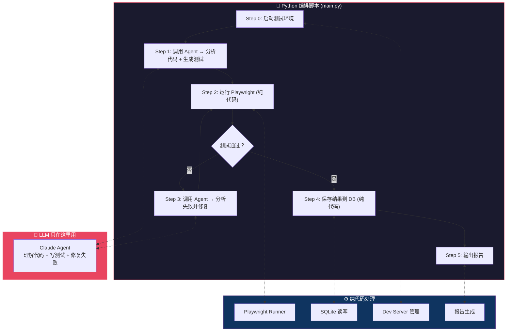
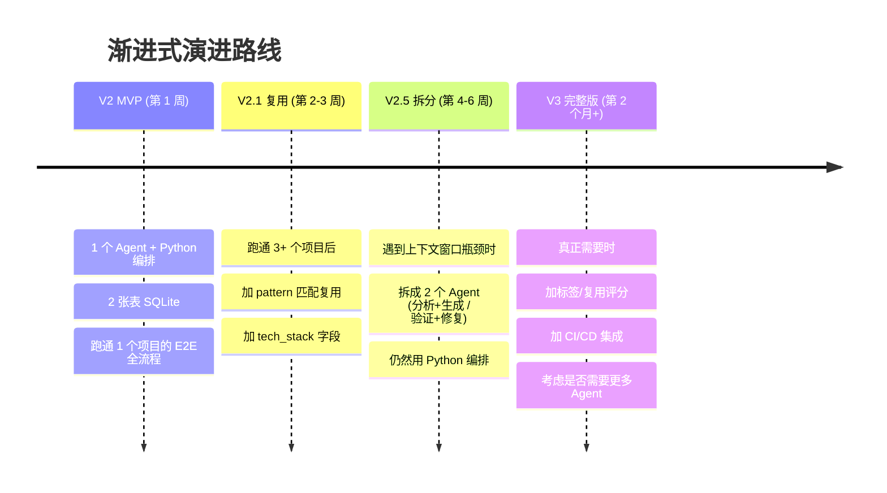

# Agent Team 端到端测试系统设计方案 V2

> **版本**: V2.0 — 第一性原理简化方案（推荐起步版本）  
> **定位**: MVP 实战起步方案，适合 0→1 的首次实施  
> **技术栈**: Claude Agent SDK + Playwright + SQLite（原生）  
> **日期**: 2026-02-24

> [!IMPORTANT]
> **这是推荐的起步方案。** 相比 [V1 完整方案](./agent-team-e2e-design-v1.md)，V2 将 6 个 Agent 精简为 1 个，用 Python 代码替代 LLM 编排，数据库从 6 表简化为 2 表，成本降低 50%+。当 V2 运行成熟后，再按需向 V1 演进。

---

## 一、V1 方案的第一性原理批判

> 以马斯克"第一性原理"视角，对 V1 方案进行理性批判，指出过度设计的部分。

### 批判 1：5 个 Agent 是过度拆分

**第一性原理问题：完成 E2E 测试生成，最少需要几个独立的"思考实体"？**

答案是 **1 个就够了**。

"分析"→"推断路径"→"写测试"→"验证"→"保存"——这些是同一个任务的不同 **步骤**，不是不同的 **职责**。一个足够好的 prompt + 正确的工具，一个 Agent 就能串行做完。拆成 5 个 Agent 就像造 5 辆车来完成一趟旅程，每辆车只跑一段路。

> **原则：最好的零件是不存在的零件。能删掉的 Agent，就应该删掉。**

**唯一需要拆分的理由**：单次对话的上下文窗口不够大（大项目代码量超出上下文限制）。这是技术约束驱动的拆分，不是"角色扮演"驱动的拆分。

### 批判 2：Orchestrator 是一个假问题

编排者 Agent 本质上就是在用自然语言做 `if-else` 流程控制。完全可以用 **Python 代码** 来做——更可靠、更可控、成本为零。

```python
# 不需要 Orchestrator Agent，普通 Python 函数就行
async def pipeline(project_path):
    report = await run_agent("analyze", project_path)     # 步骤 1
    paths = await run_agent("infer_paths", report)         # 步骤 2
    for path in paths:
        code = await run_agent("write_test", path)         # 步骤 3
        result = await run_agent("verify_test", code)      # 步骤 4
        save_to_db(result)                                 # 步骤 5 (不需要Agent)
```

> **原则：用 LLM 来做流程编排 = 用火箭发动机烧开水。能用代码解决的就用代码，LLM 只用在需要"理解"和"推理"的地方。**

### 批判 3：用例管理 Agent 不应该存在

这个 Agent 的工作是往 SQLite 写数据、查数据——**纯 CRUD 操作**。

这需要 AI 吗？不需要。一个普通的 Python 函数就能做，而且做得更好——零延迟、零成本、100% 可靠。让 Haiku 来写 SQL 语句，就像让物理学博士帮你算 1+1。

### 批判 4：数据库设计过度

6 张表、UUID 主键、复用评分算法、复用链追踪……

**先问一个问题：你现在有多少个项目？** 如果答案小于 10 个，你不需要"复用评分算法"。你需要的是一个 JSON 文件或最多一张表。

> **原则：从实际需求出发，而不是从"将来可能需要"出发。**

等你真的有 50 个项目、500 条用例时，再加复用评分也不迟。

### 批判 5：成本估算被严重低估

V1 估算中等项目约 $4.00，但忽略了：

| 被忽略的因素 | 影响 |
|-------------|------|
| 验证失败 → 修复 → 重试 | 每次重试都重复消耗 token |
| 分析大项目 | 读几十个文件，上下文窗口轻松爆满 |
| Agent 的探索和试错 | 不会一次做对，大量探索性工具调用 |
| Orchestrator 也消耗 token | 编排本身就在烧钱 |

**真实成本可能是估算的 3-5 倍**（$12-20/项目），复杂项目可能 $40+。

### 批判 6：最大缺陷——没有考虑"测试环境"问题

V1 设计 **完全没有提到被测项目怎么运行起来**。

E2E 测试需要：
- 项目的 dev server 跑起来
- 可能需要数据库、后端 API
- 可能需要 mock 数据或测试种子数据
- 可能需要特定的环境变量

> **这才是 E2E 测试最难的部分——不是写测试代码，而是让测试环境跑起来。** V1 设计了一辆完美的赛车，但忘了建赛道。

---

## 二、V2 核心原则

| 原则 | V1 (过度设计) | V2 (第一性原理) |
|------|-------------|----------------|
| Agent 数量 | 5 + 1 Orchestrator | **1 个**（按需分步调用） |
| 流程控制 | LLM 编排 | **Python 代码** |
| 数据存储 | 6 表 SQLite + 复用算法 | **2 张表 SQLite** |
| 环境管理 | ❌ 未考虑 | **✅ 作为第一步** |
| LLM 使用边界 | 到处用 | **只在"理解代码"和"写/修测试"时用** |

---

## 三、V2 架构图



---

## 四、V2 数据库（极简）

只需两张表：

```sql
CREATE TABLE IF NOT EXISTS test_cases (
    id          INTEGER PRIMARY KEY AUTOINCREMENT,
    project     TEXT NOT NULL,           -- 项目名
    tech_stack  TEXT,                     -- "vue3" / "react" / "angular"
    name        TEXT NOT NULL,           -- "用户登录"
    pattern     TEXT,                     -- "AUTH_FLOW" / "CRUD_FLOW"
    file_path   TEXT,                     -- "tests/e2e/login.spec.ts"
    code        TEXT NOT NULL,           -- 完整测试代码
    status      TEXT DEFAULT 'DRAFT',    -- DRAFT / VERIFIED / FAILED
    error_msg   TEXT,                     -- 最后一次失败信息
    created_at  DATETIME DEFAULT CURRENT_TIMESTAMP,
    verified_at DATETIME
);

CREATE TABLE IF NOT EXISTS test_runs (
    id          INTEGER PRIMARY KEY AUTOINCREMENT,
    case_id     INTEGER REFERENCES test_cases(id),
    passed      BOOLEAN NOT NULL,
    error_msg   TEXT,
    duration_ms INTEGER,
    run_at      DATETIME DEFAULT CURRENT_TIMESTAMP
);

-- 复用查询：就这么简单
-- SELECT * FROM test_cases WHERE pattern = 'AUTH_FLOW' AND status = 'VERIFIED';
```

> 没有 UUID、没有标签表、没有复用链。等真正需要时再加。

---

## 五、V2 项目结构

```
e2e-agent/
├── main.py              # 唯一入口，包含所有逻辑（不到 200 行）
├── .env                 # ANTHROPIC_API_KEY
├── data/
│   └── e2e_tests.db     # SQLite（自动创建）
└── requirements.txt     # claude-agent-sdk, playwright
```

> 对比 V1 的 20+ 个文件，V2 只有 **1 个核心文件**。

---

## 六、V2 完整代码实现

```python
# main.py — 整个 V2 的核心，不到 150 行
import asyncio
import sqlite3
import subprocess
import json
import sys
from pathlib import Path
from claude_agent_sdk import query, ClaudeAgentOptions


# ========== 数据库层（纯 Python，不需要 Agent）==========

DB_PATH = Path(__file__).parent / "data" / "e2e_tests.db"

def init_db():
    DB_PATH.parent.mkdir(exist_ok=True)
    conn = sqlite3.connect(DB_PATH)
    conn.executescript("""
        CREATE TABLE IF NOT EXISTS test_cases (
            id INTEGER PRIMARY KEY AUTOINCREMENT,
            project TEXT NOT NULL,
            tech_stack TEXT,
            name TEXT NOT NULL,
            pattern TEXT,
            file_path TEXT,
            code TEXT NOT NULL,
            status TEXT DEFAULT 'DRAFT',
            error_msg TEXT,
            created_at DATETIME DEFAULT CURRENT_TIMESTAMP,
            verified_at DATETIME
        );
        CREATE TABLE IF NOT EXISTS test_runs (
            id INTEGER PRIMARY KEY AUTOINCREMENT,
            case_id INTEGER REFERENCES test_cases(id),
            passed BOOLEAN NOT NULL,
            error_msg TEXT,
            duration_ms INTEGER,
            run_at DATETIME DEFAULT CURRENT_TIMESTAMP
        );
    """)
    conn.close()

def get_existing_cases(pattern: str = None) -> list[dict]:
    """查询已验证的用例（纯 Python，不用 Agent）"""
    conn = sqlite3.connect(DB_PATH)
    conn.row_factory = sqlite3.Row
    if pattern:
        rows = conn.execute(
            "SELECT * FROM test_cases WHERE status='VERIFIED' AND pattern=?",
            (pattern,)
        ).fetchall()
    else:
        rows = conn.execute(
            "SELECT * FROM test_cases WHERE status='VERIFIED'"
        ).fetchall()
    conn.close()
    return [dict(r) for r in rows]

def save_case(project, name, pattern, file_path, code, status, error_msg=None):
    """保存测试用例（纯 Python，不用 Agent）"""
    conn = sqlite3.connect(DB_PATH)
    conn.execute(
        """INSERT INTO test_cases (project, name, pattern, file_path, code, status, error_msg, verified_at)
           VALUES (?, ?, ?, ?, ?, ?, ?, CASE WHEN ?='VERIFIED' THEN CURRENT_TIMESTAMP ELSE NULL END)""",
        (project, name, pattern, file_path, code, status, error_msg, status)
    )
    conn.commit()
    conn.close()


# ========== 环境管理（V1 完全忽略的关键步骤）==========

def start_dev_server(project_path: str) -> subprocess.Popen:
    """启动项目的开发服务器"""
    proc = subprocess.Popen(
        ["npm", "run", "dev"],
        cwd=project_path,
        stdout=subprocess.PIPE,
        stderr=subprocess.PIPE,
    )
    # 等待服务器就绪（简单实现，可以改成轮询健康检查）
    import time
    time.sleep(10)
    print("✅ Dev server started")
    return proc


# ========== Agent 调用（只在需要"理解"的地方用 LLM）==========

async def agent_analyze_and_generate(project_path: str, existing_cases: list) -> str:
    """调用 Agent：分析代码 + 生成测试 (合并为一步)"""
    cases_context = json.dumps(existing_cases, ensure_ascii=False, indent=2) if existing_cases else "无"

    result_text = ""
    async for msg in query(
        prompt=f"""请对项目 {project_path} 执行以下任务：

1. **分析项目**：读取 package.json、路由配置、页面组件，识别技术栈和核心路由
2. **推断核心用户路径**：识别 P0/P1 级别的用户交互路径
3. **生成 Playwright 测试代码**：为每条路径生成 .spec.ts 文件，写入 tests/e2e/ 目录

参考已有的验证通过用例（可复用的部分直接适配）：
{cases_context}

要求：
- 使用 data-testid 优先的选择器策略
- 正确处理异步等待
- 每个文件顶部注释标注 pattern 类型（如 AUTH_FLOW / CRUD_FLOW）
- 最后输出一个 JSON 摘要，格式：{{"tests": [{{"name": "...", "pattern": "...", "file": "..."}}]}}""",
        options=ClaudeAgentOptions(
            allowed_tools=["Read", "Write", "Edit", "Glob", "Grep", "Bash"],
            permission_mode="acceptEdits",
            cwd=project_path,
            max_turns=50,
            max_budget_usd=2.0,
        ),
    ):
        if hasattr(msg, "result"):
            result_text = msg.result

    return result_text


async def agent_fix_failures(project_path: str, test_file: str, error_output: str) -> bool:
    """调用 Agent：分析失败原因并修复测试代码"""
    result_text = ""
    async for msg in query(
        prompt=f"""测试文件 {test_file} 运行失败，错误输出如下：

{error_output}

请：
1. 分析失败原因（选择器错误？等待超时？逻辑错误？）
2. 读取测试文件和相关源代码
3. 修复测试文件
4. 最后回复 "FIXED" 或 "UNFIXABLE" """,
        options=ClaudeAgentOptions(
            allowed_tools=["Read", "Edit", "Bash", "Grep", "Glob"],
            permission_mode="acceptEdits",
            cwd=project_path,
            max_turns=20,
            max_budget_usd=1.0,
        ),
    ):
        if hasattr(msg, "result"):
            result_text = msg.result

    return "FIXED" in result_text.upper()


# ========== Playwright 运行（纯代码，不用 Agent）==========

def run_playwright_test(project_path: str, test_file: str) -> tuple[bool, str]:
    """运行单个 Playwright 测试文件，返回 (是否通过, 输出)"""
    result = subprocess.run(
        ["npx", "playwright", "test", test_file, "--reporter=line", "--trace", "on"],
        cwd=project_path,
        capture_output=True,
        text=True,
        timeout=120,
    )
    passed = result.returncode == 0
    output = result.stdout + result.stderr
    return passed, output


# ========== 主流程（Python 编排，不是 LLM 编排）==========

async def main(project_path: str):
    project_name = Path(project_path).name
    init_db()

    # Step 0: 启动测试环境（V1 忽略的关键步骤）
    print("🚀 Step 0: 启动开发服务器...")
    server = start_dev_server(project_path)

    try:
        # Step 1: Agent 分析 + 生成（LLM 只在这里用）
        print("🧠 Step 1: Agent 分析代码并生成测试...")
        existing = get_existing_cases()
        summary = await agent_analyze_and_generate(project_path, existing)
        
        # 解析生成的测试文件列表
        tests = parse_test_summary(summary)

        # Step 2-4: 逐个验证（Python 控制循环，不是 LLM 控制）
        for test_info in tests:
            test_file = test_info["file"]
            print(f"\n🧪 验证: {test_file}")

            for attempt in range(3):  # 最多重试 3 次
                passed, output = run_playwright_test(project_path, test_file)

                if passed:
                    print(f"  ✅ 通过 (第 {attempt + 1} 次)")
                    save_case(project_name, test_info["name"], test_info.get("pattern"),
                              test_file, read_file(test_file), "VERIFIED")
                    break
                else:
                    print(f"  ❌ 失败 (第 {attempt + 1} 次)，调用 Agent 修复...")
                    fixed = await agent_fix_failures(project_path, test_file, output)
                    if not fixed:
                        print(f"  ⚠️ Agent 无法修复")
                        save_case(project_name, test_info["name"], test_info.get("pattern"),
                                  test_file, read_file(test_file), "FAILED", output[-500:])
                        break
            else:
                save_case(project_name, test_info["name"], test_info.get("pattern"),
                          test_file, read_file(test_file), "FAILED", "超过最大重试次数")

        # Step 5: 输出报告（纯代码）
        print_report(project_name)

    finally:
        server.terminate()
        print("🛑 开发服务器已停止")


def parse_test_summary(summary_text: str) -> list[dict]:
    """从 Agent 输出中解析测试文件列表"""
    try:
        import re
        match = re.search(r'\{.*"tests".*\}', summary_text, re.DOTALL)
        if match:
            return json.loads(match.group())["tests"]
    except Exception:
        pass
    return []

def read_file(path: str) -> str:
    try:
        return Path(path).read_text(encoding="utf-8")
    except Exception:
        return ""

def print_report(project_name: str):
    conn = sqlite3.connect(DB_PATH)
    total = conn.execute("SELECT COUNT(*) FROM test_cases WHERE project=?", (project_name,)).fetchone()[0]
    verified = conn.execute("SELECT COUNT(*) FROM test_cases WHERE project=? AND status='VERIFIED'", (project_name,)).fetchone()[0]
    failed = conn.execute("SELECT COUNT(*) FROM test_cases WHERE project=? AND status='FAILED'", (project_name,)).fetchone()[0]
    conn.close()
    print(f"\n{'='*50}")
    print(f"📊 测试报告: {project_name}")
    print(f"   总计: {total}  ✅ 通过: {verified}  ❌ 失败: {failed}")
    print(f"   通过率: {verified/max(total,1)*100:.1f}%")
    print(f"{'='*50}")


if __name__ == "__main__":
    asyncio.run(main(sys.argv[1]))
```

---

## 七、V1 vs V2 对比总结

| 维度 | V1 (完整方案) | V2 (第一性原理) | 建议 |
|------|-------------|----------------|------|
| 文件数量 | 20+ 个文件 | 1 个核心文件 | **从 V2 起步** |
| Agent 数量 | 6 个 (含 Orchestrator) | 1 个 (分步调用) | V2 够用 |
| 数据库 | 6 张表 + ORM | 2 张表 + 原生 SQL | V2 够用 |
| 成本/项目 | ~$4 (实际 $12-20) | ~$3 (实际 $5-8) | V2 省 50%+ |
| 测试环境 | ❌ 未考虑 | ✅ 内置 | V2 更完整 |
| 流程控制 | LLM 编排 (不可靠) | Python 代码 (确定性) | V2 更可靠 |
| 复用能力 | 完善的评分算法 | 简单 pattern 匹配 | V2 先够用 |
| 扩展性 | 开放式设计 | 按需扩展 | 等有真实需求再扩 |

---

## 八、演进路线图：从 V2 到 V1

> **不是不做 V1，而是不要一开始就做 V1。**



> [!IMPORTANT]
> **核心结论**：V1 是一个好的"终态愿景"，但不应该是第一步。**从 V2 开始，用数据驱动演进，每次只在遇到真实瓶颈时才加复杂度。**
