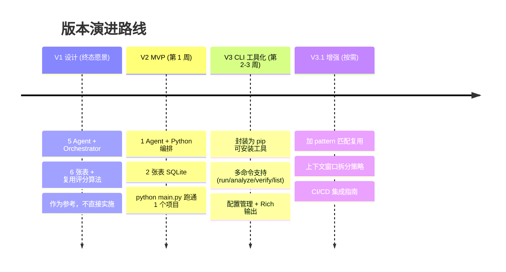

# E2E 测试生成 CLI 工具设计方案 V3

> **版本**: V3.0 — CLI 工具化方案  
> **定位**: 基于 V2 核心逻辑，封装为可安装、可分发的命令行工具  
> **技术栈**: Claude Agent SDK + Playwright + SQLite + Typer CLI  
> **日期**: 2026-02-24

> [!NOTE]
> V3 不是对 V2 逻辑的重写，而是对 V2 的 **产品化封装**。核心引擎不变（1 Agent + Python 编排），改进的是用户交互方式：从 `python main.py` 变成 `tflow run`。
>
> 版本关系：[V1 终态愿景](./agent-team-e2e-design-v1.md) → [V2 MVP 核心](./agent-team-e2e-design-v2.md) → **V3 CLI 工具化（本文档）**

---

## 一、工具定位

```
给它一个项目路径 → 自动分析代码 → 生成 Playwright E2E 测试 → 跑通验证 → 存库复用
```

一个面向前端开发者的 **本地 CLI 工具**，不需要部署服务端，`pip install` 即用。

---

## 二、命令设计

### 2.1 核心命令一览

| 命令 | 作用 | 用 LLM 吗？ |
|------|------|------------|
| `tflow run` | 完整流程：分析 + 生成 + 验证 | ✅ 是 |
| `tflow analyze` | 只分析项目结构，输出报告 | ✅ 是 |
| `tflow verify` | 只跑已有测试，失败自动修复 | ✅ 修复时用 |
| `tflow list` | 查看数据库中的用例 | ❌ 纯代码 |
| `tflow export` | 导出用例到指定目录 | ❌ 纯代码 |
| `tflow config` | 查看/修改配置 | ❌ 纯代码 |

### 2.2 命令详细用法

#### `tflow run` — 一键生成并验证

```bash
# 最简用法
tflow run ./my-project

# 完整参数
tflow run ./my-project \
  --priority P0,P1              # 只生成 P0/P1 级别的测试路径
  --max-retry 3                 # 测试失败最多重试次数（默认 3）
  --max-budget 2.0              # LLM 调用预算上限，单位美元（默认 2.0）
  --no-server                   # 不自动启动 dev server（手动已启动时用）
  --server-url http://localhost:3000  # 指定已运行的服务地址
  --output ./tests/e2e          # 测试文件输出目录（默认 项目/tests/e2e/）
  --verbose                     # 输出详细日志
  --dry-run                     # 只生成不运行（看看生成质量）
```

**输出示例**：
```
🚀 启动开发服务器...                    ✅ localhost:5173
🧠 Agent 分析代码并生成测试...           ✅ 识别 5 条核心路径
🧪 验证: tests/e2e/login.spec.ts       ✅ 通过 (第 1 次)
🧪 验证: tests/e2e/user-crud.spec.ts   ❌ → 🔧 修复 → ✅ 通过 (第 2 次)
🧪 验证: tests/e2e/search.spec.ts      ✅ 通过 (第 1 次)
🧪 验证: tests/e2e/navigation.spec.ts  ❌ → 🔧 修复 → ❌ → ⚠️ 失败
🧪 验证: tests/e2e/form.spec.ts        ✅ 通过 (第 1 次)

══════════════════════════════════════════
📊 测试报告: my-project
   总计: 5  ✅ 通过: 4  ❌ 失败: 1
   通过率: 80.0%
   💰 本次 LLM 费用: $1.35
══════════════════════════════════════════
🛑 开发服务器已停止
```

#### `tflow analyze` — 只分析不生成

```bash
tflow analyze ./my-project

# 输出结构化分析报告到文件
tflow analyze ./my-project --output report.json
```

**用途**：先看看 Agent 对项目的理解是否正确，确认后再 `run`。

#### `tflow verify` — 只跑测试

```bash
# 跑项目下所有 e2e 测试
tflow verify ./my-project

# 跑单个文件
tflow verify ./my-project --file tests/e2e/login.spec.ts

# 失败时自动调用 Agent 修复
tflow verify ./my-project --auto-fix
```

**用途**：手动改了测试代码后想重新验证，或者 CI 中使用。

#### `tflow list` — 查看用例库

```bash
# 列出所有用例
tflow list

# 按项目筛选
tflow list --project my-project

# 按模式和状态筛选
tflow list --pattern AUTH_FLOW --status VERIFIED

# 输出为 JSON
tflow list --json
```

**输出示例**：
```
┌────┬──────────────┬────────────┬───────────┬──────────┐
│ ID │ 项目          │ 用例名      │ 模式       │ 状态     │
├────┼──────────────┼────────────┼───────────┼──────────┤
│  1 │ my-project   │ 用户登录    │ AUTH_FLOW │ VERIFIED │
│  2 │ my-project   │ 用户CRUD   │ CRUD_FLOW │ VERIFIED │
│  3 │ my-project   │ 页面导航    │ NAVIGATION│ FAILED   │
│  4 │ other-app    │ 用户登录    │ AUTH_FLOW │ VERIFIED │
└────┴──────────────┴────────────┴───────────┴──────────┘
```

#### `tflow export` — 导出用例

```bash
# 导出某项目的所有已验证用例
tflow export --project my-project --output ./exported-tests/

# 导出所有 AUTH_FLOW 模式的用例
tflow export --pattern AUTH_FLOW --output ./auth-tests/
```

#### `tflow config` — 配置管理

```bash
# 查看当前配置
tflow config show

# 设置默认 API Key
tflow config set api-key sk-ant-xxx

# 设置默认预算
tflow config set max-budget 3.0

# 设置默认服务器启动命令（非 npm run dev 的项目）
tflow config set server-cmd "yarn dev"
```

---

## 三、项目结构

```
tflow/
├── pyproject.toml              # 包定义 + CLI 入口
├── README.md
├── src/
│   └── tflow/
│       ├── __init__.py         # 版本号
│       ├── cli.py              # CLI 命令定义（Typer）
│       ├── core.py             # 核心引擎（V2 的 main.py 逻辑）
│       ├── agent.py            # Agent 调用封装
│       ├── db.py               # SQLite 操作
│       ├── server.py           # Dev Server 生命周期管理
│       ├── runner.py           # Playwright 测试运行器
│       ├── reporter.py         # 报告输出（终端表格 + JSON）
│       └── config.py           # 配置文件管理
├── data/                       # 运行时自动创建
│   └── e2e_tests.db
└── tests/
    └── test_cli.py
```

> V2 的 1 个超大文件拆成 **8 个小模块**，每个职责单一且可独立测试。但核心逻辑不变。

---

## 四、核心代码实现

### 4.1 CLI 入口 — `cli.py`

```python
# src/tflow/cli.py
import typer
from pathlib import Path
from typing import Optional
from rich.console import Console

app = typer.Typer(
    name="tflow",
    help="🧪 E2E 测试自动生成工具 — 给项目路径，自动生成并验证 Playwright 测试",
    add_completion=False,
)
console = Console()


@app.command()
def run(
    project: Path = typer.Argument(..., help="项目根目录路径", exists=True),
    priority: str = typer.Option("P0,P1", help="生成的优先级范围"),
    max_retry: int = typer.Option(3, help="失败最多重试次数"),
    max_budget: float = typer.Option(2.0, help="LLM 预算上限（美元）"),
    no_server: bool = typer.Option(False, help="不自动启动 dev server"),
    server_url: Optional[str] = typer.Option(None, help="已运行的服务地址"),
    output: Optional[Path] = typer.Option(None, help="测试文件输出目录"),
    verbose: bool = typer.Option(False, "--verbose", "-v", help="详细日志"),
    dry_run: bool = typer.Option(False, help="只生成不运行"),
):
    """一键生成并验证 E2E 测试"""
    import asyncio
    from .core import run_pipeline

    asyncio.run(run_pipeline(
        project_path=str(project),
        priorities=priority.split(","),
        max_retry=max_retry,
        max_budget=max_budget,
        auto_server=not no_server,
        server_url=server_url,
        output_dir=str(output) if output else None,
        verbose=verbose,
        dry_run=dry_run,
    ))


@app.command()
def analyze(
    project: Path = typer.Argument(..., help="项目根目录路径", exists=True),
    output: Optional[Path] = typer.Option(None, "-o", help="输出报告文件路径"),
):
    """只分析项目结构，不生成测试"""
    import asyncio
    from .core import analyze_only

    result = asyncio.run(analyze_only(str(project)))
    if output:
        output.write_text(result, encoding="utf-8")
        console.print(f"✅ 分析报告已保存到 {output}")
    else:
        console.print(result)


@app.command()
def verify(
    project: Path = typer.Argument(..., help="项目根目录路径", exists=True),
    file: Optional[str] = typer.Option(None, help="指定单个测试文件"),
    auto_fix: bool = typer.Option(False, help="失败时自动调用 Agent 修复"),
):
    """运行已有的 E2E 测试"""
    import asyncio
    from .core import verify_tests

    asyncio.run(verify_tests(str(project), test_file=file, auto_fix=auto_fix))


@app.command(name="list")
def list_cases(
    project: Optional[str] = typer.Option(None, help="按项目筛选"),
    pattern: Optional[str] = typer.Option(None, help="按模式筛选"),
    status: Optional[str] = typer.Option(None, help="按状态筛选"),
    json_output: bool = typer.Option(False, "--json", help="输出 JSON 格式"),
):
    """查看本地数据库中的用例"""
    from .db import query_cases
    from .reporter import print_cases_table, print_cases_json

    cases = query_cases(project=project, pattern=pattern, status=status)
    if json_output:
        print_cases_json(cases)
    else:
        print_cases_table(cases)


@app.command()
def export(
    project: Optional[str] = typer.Option(None, help="按项目筛选"),
    pattern: Optional[str] = typer.Option(None, help="按模式筛选"),
    output: Path = typer.Option("./exported-tests", "-o", help="导出目录"),
):
    """导出已验证的测试用例到目录"""
    from .db import query_cases

    cases = query_cases(project=project, pattern=pattern, status="VERIFIED")
    output.mkdir(parents=True, exist_ok=True)
    for case in cases:
        file_path = output / Path(case["file_path"]).name
        file_path.write_text(case["code"], encoding="utf-8")
    console.print(f"✅ 已导出 {len(cases)} 个用例到 {output}")


@app.command()
def config(
    action: str = typer.Argument(..., help="show / set"),
    key: Optional[str] = typer.Argument(None, help="配置键名"),
    value: Optional[str] = typer.Argument(None, help="配置值"),
):
    """查看或修改配置"""
    from .config import load_config, save_config, print_config

    if action == "show":
        print_config()
    elif action == "set" and key and value:
        cfg = load_config()
        cfg[key] = value
        save_config(cfg)
        console.print(f"✅ 已设置 {key} = {value}")


if __name__ == "__main__":
    app()
```

### 4.2 核心引擎 — `core.py`

```python
# src/tflow/core.py
import asyncio
from pathlib import Path
from .agent import agent_analyze_and_generate, agent_fix_failures
from .db import init_db, get_existing_cases, save_case
from .server import DevServer
from .runner import run_playwright_test
from .reporter import print_report
from rich.console import Console

console = Console()


async def run_pipeline(
    project_path: str,
    priorities: list[str] = ["P0", "P1"],
    max_retry: int = 3,
    max_budget: float = 2.0,
    auto_server: bool = True,
    server_url: str | None = None,
    output_dir: str | None = None,
    verbose: bool = False,
    dry_run: bool = False,
):
    """完整流程：分析 + 生成 + 验证"""
    project_name = Path(project_path).name
    init_db()

    # Step 0: 环境
    server = None
    if auto_server and not server_url:
        console.print("🚀 启动开发服务器...")
        server = DevServer(project_path)
        server.start()
        server_url = server.url

    try:
        # Step 1: Agent 分析 + 生成
        console.print("🧠 Agent 分析代码并生成测试...")
        existing = get_existing_cases()
        summary = await agent_analyze_and_generate(
            project_path, existing, priorities, max_budget, output_dir
        )
        tests = _parse_test_summary(summary)
        console.print(f"   识别 {len(tests)} 条核心路径")

        if dry_run:
            console.print("🏁 dry-run 模式，跳过验证")
            return

        # Step 2: 逐个验证
        for test_info in tests:
            test_file = test_info["file"]
            console.print(f"\n🧪 验证: {test_file}", end="  ")

            for attempt in range(max_retry):
                passed, output = run_playwright_test(project_path, test_file)

                if passed:
                    console.print(f"✅ 通过 (第 {attempt + 1} 次)")
                    save_case(project_name, test_info["name"],
                              test_info.get("pattern"), test_file,
                              _read_file(test_file), "VERIFIED")
                    break
                else:
                    console.print(f"❌ → 🔧 修复", end=" → ")
                    fixed = await agent_fix_failures(project_path, test_file, output)
                    if not fixed:
                        console.print("⚠️ 失败")
                        save_case(project_name, test_info["name"],
                                  test_info.get("pattern"), test_file,
                                  _read_file(test_file), "FAILED", output[-500:])
                        break
            else:
                save_case(project_name, test_info["name"],
                          test_info.get("pattern"), test_file,
                          _read_file(test_file), "FAILED", "超过最大重试次数")

        print_report(project_name)

    finally:
        if server:
            server.stop()
            console.print("🛑 开发服务器已停止")


async def analyze_only(project_path: str) -> str:
    """只分析，返回结构化报告"""
    from .agent import agent_analyze
    return await agent_analyze(project_path)


async def verify_tests(project_path: str, test_file: str = None, auto_fix: bool = False):
    """只跑测试"""
    import glob
    files = [test_file] if test_file else glob.glob(f"{project_path}/tests/e2e/**/*.spec.ts", recursive=True)

    for f in files:
        passed, output = run_playwright_test(project_path, f)
        status = "✅" if passed else "❌"
        console.print(f"{status} {f}")

        if not passed and auto_fix:
            fixed = await agent_fix_failures(project_path, f, output)
            console.print(f"   🔧 {'已修复' if fixed else '无法修复'}")


def _parse_test_summary(summary_text: str) -> list[dict]:
    import json, re
    try:
        match = re.search(r'\{.*"tests".*\}', summary_text, re.DOTALL)
        if match:
            return json.loads(match.group())["tests"]
    except Exception:
        pass
    return []

def _read_file(path: str) -> str:
    try:
        return Path(path).read_text(encoding="utf-8")
    except Exception:
        return ""
```

### 4.3 Dev Server 管理 — `server.py`

```python
# src/tflow/server.py
import subprocess
import time
import socket
from rich.console import Console

console = Console()


class DevServer:
    """开发服务器生命周期管理"""

    def __init__(self, project_path: str, cmd: str = "npm run dev", port: int = None):
        self.project_path = project_path
        self.cmd = cmd
        self.port = port or self._find_free_port()
        self.url = f"http://localhost:{self.port}"
        self.process = None

    def start(self, timeout: int = 30):
        """启动并等待服务就绪"""
        self.process = subprocess.Popen(
            self.cmd.split(),
            cwd=self.project_path,
            stdout=subprocess.PIPE,
            stderr=subprocess.PIPE,
            env={**__import__("os").environ, "PORT": str(self.port)},
        )

        # 轮询等待端口可用（比 sleep(10) 好得多）
        for i in range(timeout):
            if self._is_port_open():
                console.print(f"✅ Dev server 就绪: {self.url}")
                return
            time.sleep(1)

        raise TimeoutError(f"Dev server 未在 {timeout}s 内启动")

    def stop(self):
        if self.process:
            self.process.terminate()
            self.process.wait(timeout=5)

    def _is_port_open(self) -> bool:
        try:
            with socket.create_connection(("localhost", self.port), timeout=1):
                return True
        except (ConnectionRefusedError, TimeoutError):
            return False

    @staticmethod
    def _find_free_port() -> int:
        with socket.socket() as s:
            s.bind(("", 0))
            return s.getsockname()[1]
```

### 4.4 配置管理 — `config.py`

```python
# src/tflow/config.py
import json
from pathlib import Path
from rich.console import Console

CONFIG_DIR = Path.home() / ".tflow"
CONFIG_FILE = CONFIG_DIR / "config.json"

DEFAULT_CONFIG = {
    "api-key": "",
    "max-budget": 2.0,
    "max-retry": 3,
    "server-cmd": "npm run dev",
    "default-priority": "P0,P1",
}

def load_config() -> dict:
    if CONFIG_FILE.exists():
        return {**DEFAULT_CONFIG, **json.loads(CONFIG_FILE.read_text())}
    return DEFAULT_CONFIG.copy()

def save_config(cfg: dict):
    CONFIG_DIR.mkdir(parents=True, exist_ok=True)
    CONFIG_FILE.write_text(json.dumps(cfg, indent=2, ensure_ascii=False))

def print_config():
    console = Console()
    cfg = load_config()
    for k, v in cfg.items():
        display_v = "***" if k == "api-key" and v else v
        console.print(f"  {k}: {display_v}")
```

### 4.5 打包配置 — `pyproject.toml`

```toml
[project]
name = "tflow"
version = "0.3.0"
description = "E2E 测试自动生成 CLI 工具"
requires-python = ">=3.11"
dependencies = [
    "claude-agent-sdk",
    "typer[all]>=0.9.0",
    "rich>=13.0",
]

[project.optional-dependencies]
dev = ["pytest", "pytest-asyncio"]

[project.scripts]
tflow = "tflow.cli:app"

[build-system]
requires = ["setuptools>=68.0"]
build-backend = "setuptools.backends._legacy:_Backend"
```

---

## 五、V2 → V3 变更对比

| 维度 | V2 | V3 |
|------|-----|-----|
| 入口 | `python main.py ./project` | `tflow run ./project` |
| 安装方式 | 手动拷贝脚本 | `pip install tflow` |
| 代码组织 | 1 个文件 ~200 行 | 8 个模块，职责分离 |
| 用户交互 | 纯 print | Rich 格式化表格 + 颜色 |
| 服务器管理 | `sleep(10)` 等待 | 端口轮询，超时检测 |
| 配置管理 | 硬编码 | `~/.tflow/config.json` |
| 核心逻辑 | **不变** | **不变** |
| Agent 数量 | 1 个 | 1 个（不变） |
| 数据库 | 2 张表 | 2 张表（不变） |

> [!TIP]
> V3 的本质是 **V2 的产品化包装**。如果你还在验证 V2 的核心逻辑是否 work，不需要急着做 V3。等 V2 在 2-3 个项目上跑通后，再升级为 V3 的 CLI 形态。

---

## 六、安装与使用

```bash
# 从源码安装
git clone <repo>
cd tflow
pip install -e .

# 初始化配置
tflow config set api-key sk-ant-your-key-here

# 对项目运行
tflow run ./my-vue-project

# 查看结果
tflow list --project my-vue-project
```

---

## 七、版本演进全景


